# SmartMed-Watch: Wear OS Application for ML-DDMSS

## 📋 Table of Contents
1. [Overview](#overview)
2. [System Architecture](#system-architecture)
3. [SmartWatch Role in ML-DDMSS](#smartwatch-role-in-ml-ddmss)
4. [Application Architecture](#application-architecture)
5. [Features](#features)
6. [Technical Implementation](#technical-implementation)
7. [Data Flow](#data-flow)
8. [Screenshots](#screenshots)
9. [Project Structure](#project-structure)
10. [Related Repositories](#related-repositories)
11. [Technologies Used](#technologies-used)
12. [Setup & Installation](#setup--installation)

---

## Overview

**SmartMed-Watch** is a Wear OS application that serves as the IoT data collection layer for the **Machine Learning-Based Disease Diagnosis & Medical Service System (ML-DDMSS)**. This smartwatch application continuously monitors user health metrics through built-in sensors and transmits real-time data to Firebase, which is then processed by the main ML-DDMSS system for disease diagnosis and medical service recommendations.

### Key Purpose
- **Real-time Health Monitoring**: Collects vital health metrics (heart rate, temperature, steps, blood pressure)
- **Automatic Data Transmission**: Automatically uploads health data to Firebase Cloud Firestore every 12 minutes using background workers
- **Manual Upload (Testing)**: Provides manual upload button for testing and immediate data synchronization
- **User Interface**: Provides an intuitive interface for viewing health metrics on the smartwatch
- **Integration Point**: Feeds data to the main ML-DDMSS system for machine learning-based disease diagnosis

---

## System Architecture

### High-Level ML-DDMSS Architecture

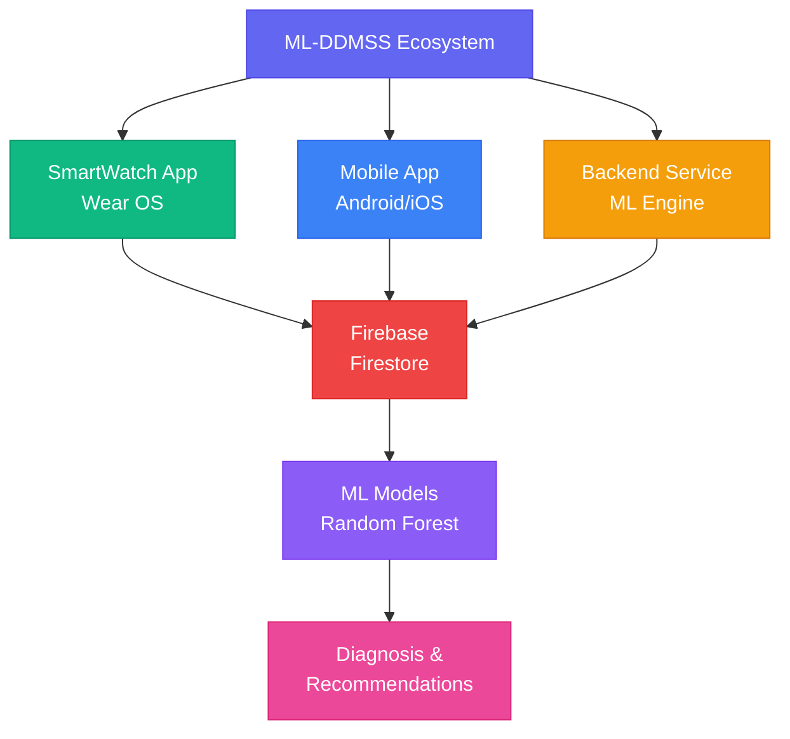

#### ASCII Diagram (Alternative View)

```
┌─────────────────────────────────────────────────────────────────┐
│                    ML-DDMSS Ecosystem                           │
└─────────────────────────────────────────────────────────────────┘
                              │
        ┌─────────────────────┼─────────────────────┐
        │                     │                     │
        ▼                     ▼                     ▼
┌───────────────┐    ┌───────────────┐    ┌───────────────┐
│  SmartWatch  │    │  Mobile App   │    │   Backend     │
│   (Wear OS)  │    │  (Android/iOS)│    │   (ML Engine) │
└───────────────┘    └───────────────┘    └───────────────┘
        │                     │                     │
        │                     │                     │
        └─────────────────────┼─────────────────────┘
                              │
                              ▼
                    ┌──────────────────┐
                    │   Firebase       │
                    │   (Firestore)    │
                    └──────────────────┘
                              │
                              ▼
                    ┌──────────────────┐
                    │  ML Models       │
                    │  (Random Forest) │
                    └──────────────────┘
                              │
                              ▼
                    ┌──────────────────┐
                    │  Diagnosis &     │
                    │  Recommendations │
                    └──────────────────┘
```

### Data Flow Diagram

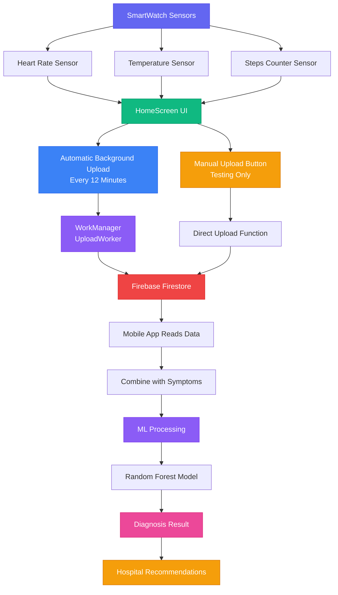

#### ASCII Diagram (Alternative View)

```
┌─────────────────────────────────────────────────────────────┐
│                    SmartWatch Data Collection                │
└─────────────────────────────────────────────────────────────┘
                              │
        ┌─────────────────────┼─────────────────────┐
        │                     │                     │
        ▼                     ▼                     ▼
┌──────────────┐    ┌──────────────┐    ┌──────────────┐
│ Heart Rate   │    │ Temperature  │    │ Steps Counter │
│   Sensor     │    │   Sensor     │    │    Sensor     │
└──────────────┘    └──────────────┘    └──────────────┘
        │                     │                     │
        └─────────────────────┼─────────────────────┘
                              │
                              ▼
                    ┌──────────────────┐
                    │  HomeScreen UI   │
                    │  (Display Data)  │
                    └──────────────────┘
                              │
        ┌─────────────────────┼─────────────────────┐
        │                     │                     │
        ▼                     ▼                     ▼
┌──────────────────┐  ┌──────────────────┐  ┌──────────────────┐
│ WorkManager      │  │ Manual Upload    │  │  Real-time       │
│ (Background)     │  │ Button           │  │  Display         │
│ Every 12 min     │  │ (Testing Only)   │  │  (UI Update)     │
└────────┬─────────┘  └────────┬─────────┘  └──────────────────┘
         │                     │
         └──────────┬──────────┘
                    │
                    ▼
          ┌──────────────────┐
          │  Firebase       │
          │  Firestore      │
          └──────────────────┘
                    │
                    ▼
          ┌──────────────────┐
          │  Mobile App      │
          │  (Reads Data)    │
          └──────────────────┘
                    │
                    ▼
          ┌──────────────────┐
          │  ML Processing   │
          │  + Symptoms      │
          └──────────────────┘
                    │
                    ▼
          ┌──────────────────┐
          │  Diagnosis &     │
          │  Hospital Rec.   │
          └──────────────────┘
```

---

## SmartWatch Role in ML-DDMSS

The SmartMed-Watch application plays a **critical role** as the primary IoT data collection device in the ML-DDMSS ecosystem:

### 1. **Continuous Health Monitoring**
- Monitors vital signs 24/7 through built-in sensors
- Tracks heart rate, body temperature, step count, and blood pressure
- Provides real-time health status to users

### 2. **Data Collection & Transmission**
- **Automatic Background Upload**: Collects and transmits sensor data every 12 minutes using WorkManager
- **Manual Upload Option**: Provides manual upload button for testing and immediate synchronization
- Transmits health metrics to Firebase Cloud Firestore
- Ensures data is available for ML processing in real-time

### 3. **User Interface**
- Displays health metrics in an easy-to-read format
- Shows real-time sensor readings
- Provides manual upload button for testing purposes (automatic upload runs in background)
- Shows connection status and data synchronization state

### 4. **Integration with ML-DDMSS**
- Feeds health data to the main ML-DDMSS system
- Works in conjunction with user-reported symptoms (collected via mobile app)
- Enables the ML engine to make accurate disease predictions

### 5. **Healthcare Accessibility**
- Particularly valuable in remote or underserved areas
- Enables early disease detection through continuous monitoring
- Facilitates timely medical intervention

---

## Application Architecture

### Component Architecture

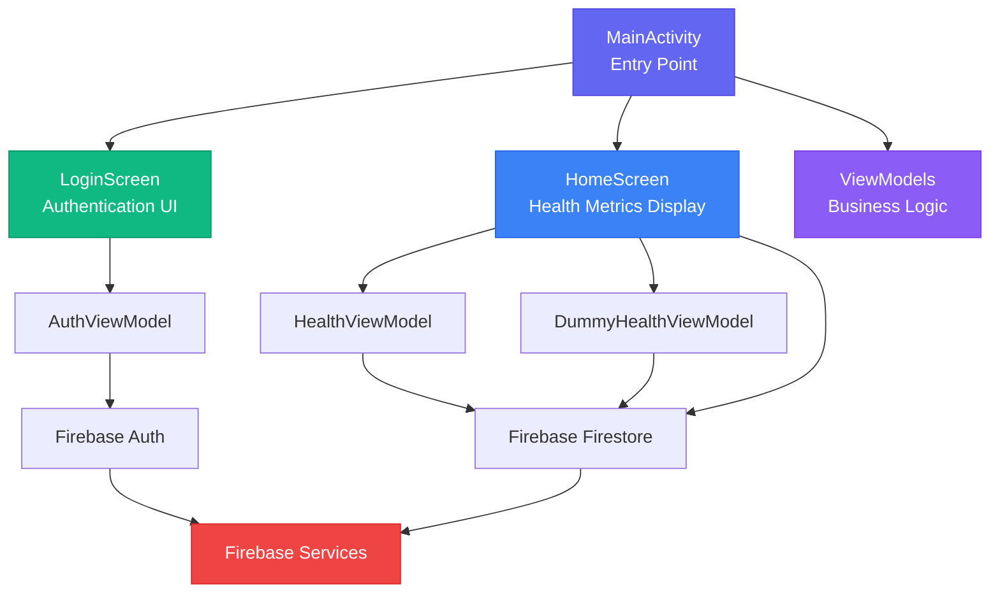

#### ASCII Diagram (Alternative View)

```
┌─────────────────────────────────────────────────────────────┐
│                      MainActivity                           │
│  • Entry Point                                              │
│  • Navigation Management                                    │
│  • Permission Handling                                      │
└─────────────────────────────────────────────────────────────┘
                              │
        ┌─────────────────────┼─────────────────────┐
        │                     │                     │
        ▼                     ▼                     ▼
┌───────────────┐    ┌───────────────┐    ┌───────────────┐
│ LoginScreen   │    │  HomeScreen   │    │   ViewModels  │
│               │    │               │    │               │
│ • Auth UI     │    │ • Sensor Data │    │ • AuthViewModel│
│ • Firebase    │    │ • Upload      │    │ • HealthVM    │
│   Auth        │    │ • Display     │    │ • DummyHealthVM│
└───────────────┘    └───────────────┘    └───────────────┘
                              │
                              ▼
                    ┌──────────────────┐
                    │  Firebase       │
                    │  • Auth         │
                    │  • Firestore    │
                    │  • Messaging    │
                    └──────────────────┘
```

### Class Diagram

```
┌─────────────────────┐
│   MainActivity      │
│─────────────────────│
│ + onCreate()        │
│ + MainApp()         │
└──────────┬──────────┘
           │
           ├─────────────────┐
           │                 │
           ▼                 ▼
┌──────────────────┐  ┌──────────────────┐
│  LoginScreen     │  │  HomeScreen      │
│──────────────────│  │──────────────────│
│ - email          │  │ - heartRate      │
│ - password       │  │ - temperature    │
│ + signIn()       │  │ - steps          │
└──────────┬───────┘  │ - bloodPressure  │
           │          │ + uploadData()    │
           │          └──────────┬────────┘
           │                     │
           ▼                     ▼
┌──────────────────┐  ┌──────────────────┐
│  AuthViewModel   │  │ HealthViewModel   │
│──────────────────│  │──────────────────│
│ - auth           │  │ - sensorManager  │
│ - user           │  │ - heartRate      │
│ - loading        │  │ - temperature    │
│ + signIn()       │  │ + startSensors() │
│ + signOut()      │  │ + uploadData()   │
└──────────────────┘  └──────────────────┘
```

---

## Features

### 🔐 Authentication
- **Firebase Email/Password Authentication**
- Secure user login with session management
- Automatic navigation to home screen upon successful authentication

### 📊 Health Metrics Display
- **Heart Rate (BPM)**: Real-time monitoring via heart rate sensor
- **Body Temperature (°C)**: Ambient temperature sensor readings
- **Step Count**: Activity recognition and step counter
- **Blood Pressure (mmHg)**: Currently using dummy data (can be integrated with external devices)

### 📤 Data Upload
- **Automatic Background Upload**: Primary method - automatically uploads health data every 12 minutes using WorkManager
- **Manual Upload Button**: Testing/development feature - allows immediate data synchronization on demand
- **Firebase Integration**: Secure data transmission to Firestore
- **User-Specific Storage**: Data organized by user ID in Firebase

### 🔔 Notifications
- **Firebase Cloud Messaging**: Push notification support
- **Permission Management**: Android 13+ notification permission handling

### 🎨 User Interface
- **Wear OS Optimized**: Circular and square display support
- **Dark Theme**: Eye-friendly dark color scheme
- **Responsive Design**: Adapts to different watch screen sizes

---

## Technical Implementation

### 1. Sensor Data Collection

The application uses Android's Sensor API to collect health data:

```kotlin
// Sensor Registration
val sensorManager = context.getSystemService(Context.SENSOR_SERVICE) as SensorManager
val heartRateSensor = sensorManager.getDefaultSensor(Sensor.TYPE_HEART_RATE)
val tempSensor = sensorManager.getDefaultSensor(Sensor.TYPE_AMBIENT_TEMPERATURE)
val stepSensor = sensorManager.getDefaultSensor(Sensor.TYPE_STEP_COUNTER)

// Sensor Listener
sensorManager.registerListener(sensorEventListener, sensor, SensorManager.SENSOR_DELAY_UI)
```

**Supported Sensors:**
- `TYPE_HEART_RATE`: Measures heart rate in beats per minute (BPM)
- `TYPE_AMBIENT_TEMPERATURE`: Measures ambient/body temperature
- `TYPE_STEP_COUNTER`: Tracks step count

### 2. Permission Management

The app requests necessary permissions for sensor access:

```xml
<uses-permission android:name="android.permission.BODY_SENSORS" />
<uses-permission android:name="android.permission.ACTIVITY_RECOGNITION" />
<uses-permission android:name="android.permission.POST_NOTIFICATIONS" />
```

**Permission Flow:**
1. App checks for required permissions on launch
2. Requests permissions if not granted
3. Falls back to dummy data if permissions denied
4. Updates UI based on permission status

### 3. Firebase Integration

#### Authentication
```kotlin
// Firebase Auth
Firebase.auth.signInWithEmailAndPassword(email, password)
    .addOnCompleteListener { task ->
        if (task.isSuccessful) {
            // Navigate to home screen
        }
    }
```

#### Firestore Data Structure
```
users/
  └── {userId}/
      └── smartwatch/
          └── {recordId}/
              ├── heart_rate: Int
              ├── temperature: Float
              ├── steps: Int
              ├── blood_pressure: String
              └── timestamp: Long
```

#### Data Upload

**Primary Method: Automatic Background Upload**

The app uses Android WorkManager to automatically upload health data every 12 minutes in the background:

```kotlin
// Scheduled in MainActivity (currently commented for testing)
val uploadWorkRequest = PeriodicWorkRequestBuilder<UploadWorker>(
    12, TimeUnit.MINUTES
).build()
WorkManager.getInstance(this).enqueue(uploadWorkRequest)
```

**UploadWorker Implementation:**
```kotlin
class UploadWorker(context: Context, workerParams: WorkerParameters) : Worker(context, workerParams) {
    override fun doWork(): Result {
        // Collects current sensor data
        // Uploads to Firebase Firestore
        // Runs automatically every 12 minutes
    }
}
```

**Secondary Method: Manual Upload (Testing)**

The manual upload button in HomeScreen allows immediate data synchronization for testing purposes:

```kotlin
// Manual upload function in HomeScreen
uploadDataToFirebase(heartRate, temperature, steps, bloodPressure, context) {
    // Callback on completion
}
```

**Firestore Data Structure:**
```kotlin
db.collection("users")
    .document(userId)
    .collection("smartwatch")
    .document(recordId)
    .set(data)
    .addOnSuccessListener { /* Success */ }
    .addOnFailureListener { /* Error */ }
```

### 4. Navigation

Uses Jetpack Compose Navigation:

```kotlin
NavHost(navController = navController, startDestination = "login") {
    composable("login") {
        LoginScreen(authViewModel, navController)
    }
    composable("home") {
        HomeScreen(context = context, navController)
    }
}
```

### 5. State Management

- **ViewModel Pattern**: Separation of business logic from UI
- **LiveData**: Reactive data observation
- **Compose State**: UI state management with `remember` and `mutableStateOf`

### 6. Background Data Upload

The app implements automatic background data upload using Android WorkManager:

**WorkManager Configuration:**
- **Upload Interval**: Every 12 minutes
- **Worker Class**: `UploadWorker`
- **Execution**: Runs in background, independent of app lifecycle
- **Data Collection**: Collects current sensor values at upload time
- **Firebase Integration**: Direct upload to Firestore

**Manual Upload (Testing):**
- Available via "Upload Data" button in HomeScreen
- Useful for testing and immediate data synchronization
- Provides user feedback via Toast messages
- Not required for normal operation (automatic upload handles data transmission)

---

## Data Flow

### Complete Data Flow Sequence

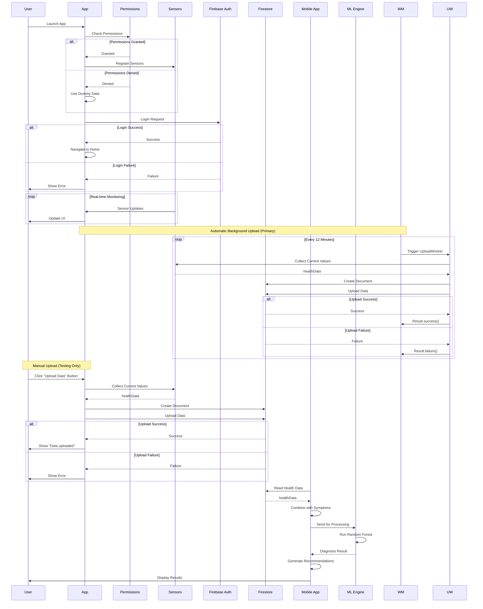

#### Step-by-Step Flow (Text Format)

```
1. User Launches App
   │
   ▼
2. Permission Check
   │
   ├─→ Granted → Register Sensors
   └─→ Denied → Use Dummy Data
   │
   ▼
3. User Login (Firebase Auth)
   │
   ├─→ Success → Navigate to Home
   └─→ Failure → Show Error
   │
   ▼
4. HomeScreen Displays
   │
   ├─→ Real Sensors → Update UI in Real-time
   └─→ Dummy Data → Generate Random Values
   │
   ▼
5. Automatic Background Upload (Primary Method)
   │
   ├─→ WorkManager schedules UploadWorker every 12 minutes
   ├─→ UploadWorker collects current sensor values
   ├─→ Creates Firestore document
   │   ├─→ Structure: users/{userId}/smartwatch/{recordId}
   │   └─→ Data: {heart_rate, temperature, steps, blood_pressure, timestamp}
   ├─→ Uploads to Firebase (background, no UI feedback)
   └─→ Repeats automatically
   │
   ▼
6. Manual Upload (Testing Method - Optional)
   │
   ├─→ User clicks "Upload Data" button
   ├─→ Collects current sensor values
   ├─→ Creates Firestore document
   ├─→ Uploads to Firebase
   └─→ Shows Toast message (success/failure)
   │
   ▼
7. Mobile App Reads Data
   │
   ▼
10. ML Processing
    │
    ├─→ Combine with User Symptoms
    └─→ Run Random Forest Model
    │
    ▼
11. Generate Diagnosis
    │
    ▼
12. Recommend Hospitals
```

### Upload Process Detail

#### Automatic Background Upload (Primary Method)

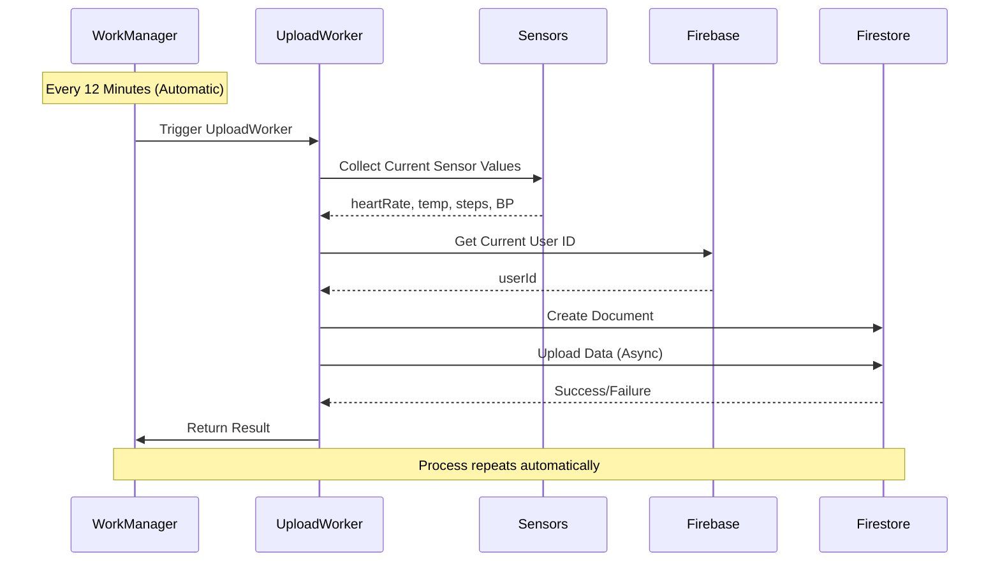

#### Manual Upload (Testing Method)

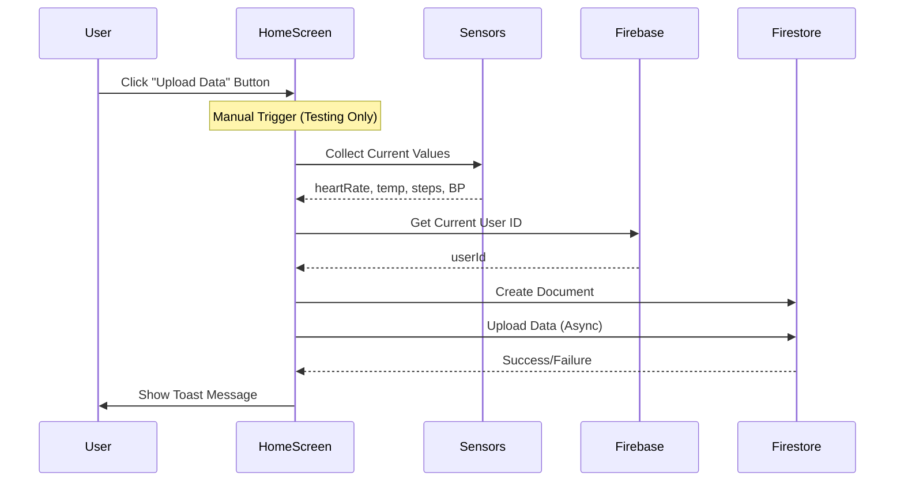

#### ASCII Diagram (Alternative View)

**Automatic Background Upload (Primary)**

```
┌──────────────────┐
│  WorkManager      │
│  (Scheduler)      │
└──────┬───────────┘
       │
       │ Every 12 Minutes
       ▼
┌──────────────────┐
│  UploadWorker    │
│  (Background)     │
└──────┬───────────┘
       │
       │ Collect Sensor Data
       ▼
┌──────────────────┐
│ Collect Data     │
│ • heartRate      │
│ • temp           │
│ • steps          │
│ • BP             │
└──────┬───────────┘
       │
       ▼
┌──────────────────┐
│ Get User ID      │
│ (Firebase)       │
└──────┬───────────┘
       │
       ▼
┌──────────────────┐
│ Create Doc       │
│ (Firestore)      │
└──────┬───────────┘
       │
       ▼
┌──────────────────┐
│ Upload Data      │
│ (Async)          │
└──────┬───────────┘
       │
       ├─→ Success → Log
       └─→ Failure → Retry
```

**Manual Upload (Testing)**

```
┌──────────────┐
│  HomeScreen  │
│  (User UI)   │
└──────┬───────┘
       │
       │ User clicks "Upload Data"
       ▼
┌──────────────┐
│ Collect Data │
│ • heartRate  │
│ • temp       │
│ • steps      │
│ • BP         │
└──────┬───────┘
       │
       ▼
┌──────────────┐
│ Get User ID  │
│ (Firebase)   │
└──────┬───────┘
       │
       ▼
┌──────────────┐
│ Create Doc   │
│ (Firestore)  │
└──────┬───────┘
       │
       ▼
┌──────────────┐
│ Upload Data  │
│ (Async)      │
└──────┬───────┘
       │
       ├─→ Success → Toast
       └─→ Failure → Error Toast
```

---

## Screenshots

### Login Screen

The login screen provides a secure authentication interface optimized for Wear OS:

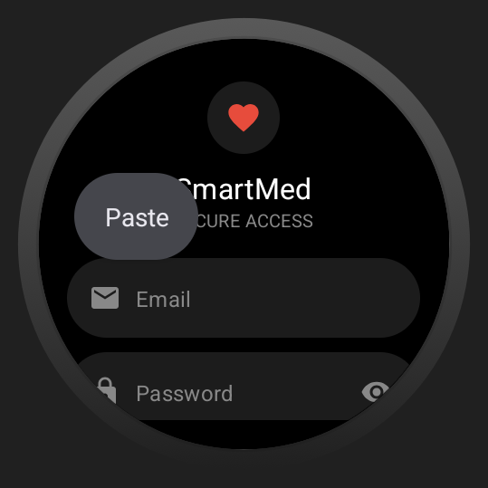

*Login screen with email and password fields*

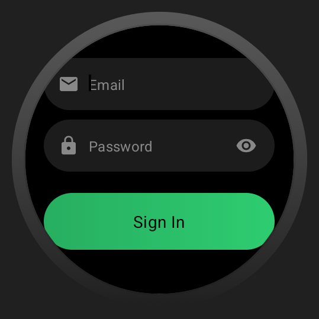

*Login screen showing the circular design optimized for round watches*

### Home Screen

The home screen displays all health metrics in a grid layout:

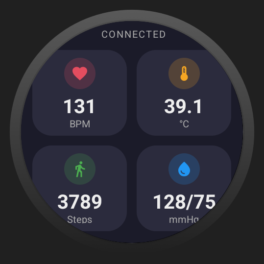

*Home screen showing heart rate, temperature, steps, and blood pressure metrics*

### Upload Functionality

The upload screen shows the data upload process:

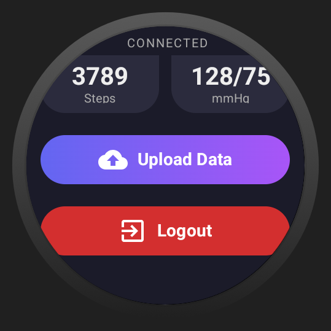

*Home screen with upload button and health metrics display*

---

## Project Structure

```
SmartMed-Watch/
├── app/
│   ├── src/
│   │   └── main/
│   │       ├── java/com/medbytes/smartwatch/
│   │       │   └── presentation/
│   │       │       ├── MainActivity.kt          # Entry point
│   │       │       ├── services/
│   │       │       │   └── MyFirebaseMessagingService.kt
│   │       │       ├── theme/
│   │       │       │   └── Theme.kt
│   │       │       ├── viewmodels/
│   │       │       │   ├── AuthViewModel.kt      # Authentication logic
│   │       │       │   ├── HealthViewModel.kt   # Real sensor data
│   │       │       │   └── DummyHealthViewModel.kt  # Dummy data generator
│   │       │       └── views/
│   │       │           ├── HomeScreen.kt        # Main health display
│   │       │           ├── LoginScreen.kt      # Authentication UI
│   │       │           ├── UploadWorker.kt     # Background upload
│   │       │           └── widgets/
│   │       │               └── CustomTextField.kt
│   │       ├── res/                             # Resources
│   │       └── AndroidManifest.xml
│   ├── build.gradle.kts
│   └── google-services.json
├── gradle/
│   └── libs.versions.toml
├── build.gradle.kts
└── README.md
```

### Key Files Description

| File | Purpose |
|------|---------|
| `MainActivity.kt` | Application entry point, navigation setup, permission handling |
| `LoginScreen.kt` | Firebase authentication UI for Wear OS |
| `HomeScreen.kt` | Main screen displaying health metrics and upload functionality |
| `AuthViewModel.kt` | Manages Firebase authentication state and operations |
| `HealthViewModel.kt` | Real sensor data collection (alternative implementation) |
| `DummyHealthViewModel.kt` | Generates dummy health data |
| `UploadWorker.kt` | Background worker for automatic periodic data uploads (every 12 minutes) |

---

## Related Repositories

### Mobile Application
The mobile application (Android/iOS) that provides the main user interface for ML-DDMSS:

🔗 **GitHub Repository**: [ML-DDMSS Mobile App](https://github.com/your-org/mlddmss-mobile-app)

**Features:**
- User symptom input
- Disease diagnosis interface
- Hospital recommendations via Google Maps
- Health history viewing
- Integration with smartwatch data

### Backend Services
The backend service that processes health data and runs ML models:

🔗 **GitHub Repository**: [ML-DDMSS Backend](https://github.com/your-org/mlddmss-backend)

**Features:**
- ML model inference (Random Forest)
- Data processing pipeline
- Hospital recommendation algorithm
- API endpoints for mobile app
- Firebase integration

### System Integration

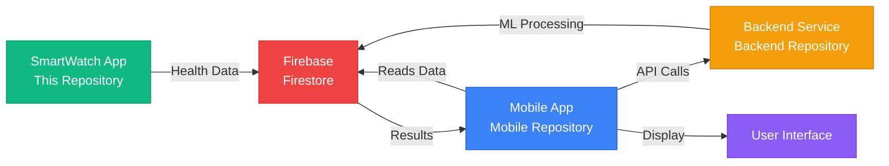

#### ASCII Diagram (Alternative View)

```
┌──────────────┐         ┌──────────────┐         ┌──────────────┐
│ SmartWatch   │────────▶│   Mobile     │────────▶│   Backend    │
│   App        │  Data   │    App       │  API    │   Service    │
│              │         │              │         │              │
│ (This Repo)  │         │ (Mobile Repo)│         │(Backend Repo)│
└──────────────┘         └──────────────┘         └──────────────┘
       │                        │                        │
       └────────────────────────┼────────────────────────┘
                                │
                                ▼
                        ┌──────────────┐
                        │   Firebase   │
                        │  (Firestore) │
                        └──────────────┘
```

---

## Technologies Used

### Core Technologies
- **Kotlin**: Primary programming language
- **Jetpack Compose**: Modern UI framework for Wear OS
- **Wear OS**: Target platform (Android Wear)

### Firebase Services
- **Firebase Authentication**: User authentication
- **Cloud Firestore**: Real-time database for health data
- **Firebase Cloud Messaging**: Push notifications

### Android Components
- **Sensor API**: Health sensor data collection
- **WorkManager**: Background task scheduling
- **Navigation Component**: Screen navigation
- **ViewModel**: State management
- **LiveData**: Reactive data streams

### Libraries & Dependencies
- **Play Services Wearable**: Wear OS integration
- **Material Design 3**: UI components
- **Compose Material**: Wear OS compose components

---

## Setup & Installation

### Prerequisites
- Android Studio Hedgehog or later
- Wear OS emulator or physical device
- Firebase project with Firestore enabled
- Google account for Firebase setup

### Installation Steps

1. **Clone the Repository**
   ```bash
   git clone https://github.com/your-org/smartmed-watch.git
   cd smartmed-watch
   ```

2. **Firebase Setup**
   - Create a Firebase project at [Firebase Console](https://console.firebase.google.com/)
   - Enable Authentication (Email/Password)
   - Enable Cloud Firestore
   - Download `google-services.json` and place it in `app/` directory

3. **Configure Permissions**
   - Ensure `BODY_SENSORS` permission is granted (for real sensor data)
   - Grant `ACTIVITY_RECOGNITION` permission (for step counting)
   - Grant `POST_NOTIFICATIONS` permission (Android 13+)

4. **Build & Run**
   ```bash
   ./gradlew assembleDebug
   ./gradlew installDebug
   ```

5. **Deploy to Watch**
   - Connect Wear OS device/emulator
   - Run the app from Android Studio
   - Or install APK manually

### Configuration

Update Firebase configuration in `app/google-services.json` with your project credentials.

---

## Future Enhancements

Based on the thesis findings, potential future improvements include:

1. **Doctor Appointment Integration**: Schedule appointments directly from the watch
2. **Personalized Predictions**: ML models tailored to individual user health patterns
3. **Voice Chat Interface**: Voice-based symptom reporting for better user experience
4. **Continuous Monitoring**: Automatic background data collection and upload
5. **Alert System**: Notifications for abnormal health readings
6. **Multi-device Sync**: Synchronization with multiple health devices

---

## Contributors

- **Anees Ahmad** (FA20-BSE-004)
- **Mujahid Zareen** (FA20-BSE-026)
- **Adnan Ashraf** (FA20-BSE-072)

**Project Supervisor**: Dr. Tehmina Shahryar  
**Department**: Software Engineering  
**Institution**: Mirpur University of Science and Technology

---

## License

This project is developed as part of the Final Year Project (FYP) at Mirpur University of Science and Technology. All rights reserved.

---

## References

1. S. T. Himi, N. T. Monalisa, M. Whaiduzzaman, A. Barros, and M. S. Uddin, "MedAi: A smartwatch-based application framework for the prediction of common diseases using machine learning," IEEE Access, vol. 11, pp. 12342-12359, 2023.

2. P. Hema, N. Sunny, R. V. Naganjani, and A. Darbha, "Disease prediction using symptoms based on machine learning algorithms," in 2022 International Conference on Breakthrough in Heuristics And Reciprocation of Advanced Technologies (BHARAT), 2022: IEEE, pp. 49-54.

3. C.-T. Wu et al., "A precision health service for chronic diseases: development and cohort study using wearable device, machine learning, and deep learning," IEEE Journal of Translational Engineering in Health and Medicine, vol. 10, pp. 1-14, 2022.

---

**For more details, please refer to the complete thesis document**: [Final Thesis v 9.0.0.pdf](../screenshots/final%20thesis%20v%209.0.0.pdf)

---

*Last Updated: September 2024*

